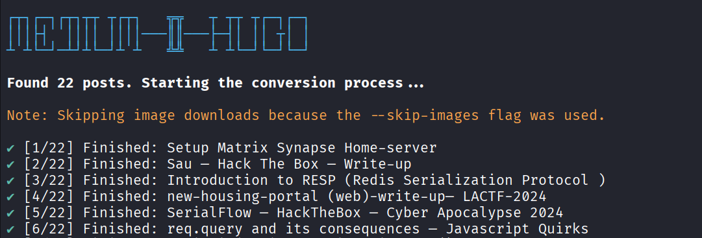
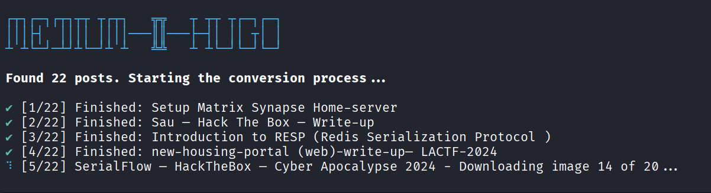

# medium-2-hugo
Your files will be downloaded in a structure akin to below -
```
./hugo_content
   -> post_title_or_slug
      -> index.md
      -> images-x.abc
```

## Usage
```bash
./medium-2-hugo --help
```
```bash
Usage: medium-2-hugo [options]

Convert Medium exported HTML posts into Hugo Page Bundles.

Options:
  -i, --input <path>   Path to the folder containing Medium HTML files
  -o, --output <path>  Path to generate the Hugo content (default: "./hugo_content")
  -s, --skip-images    Skip downloading images (useful if already downloaded)
  -h, --help           display help for command
```

```bash
./medium-2-hugo -i posts -s
```



```bash
./medium-2-hugo -i posts
```


